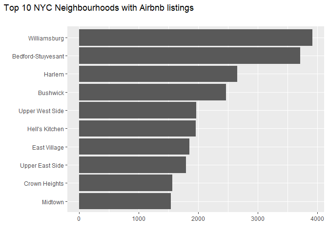
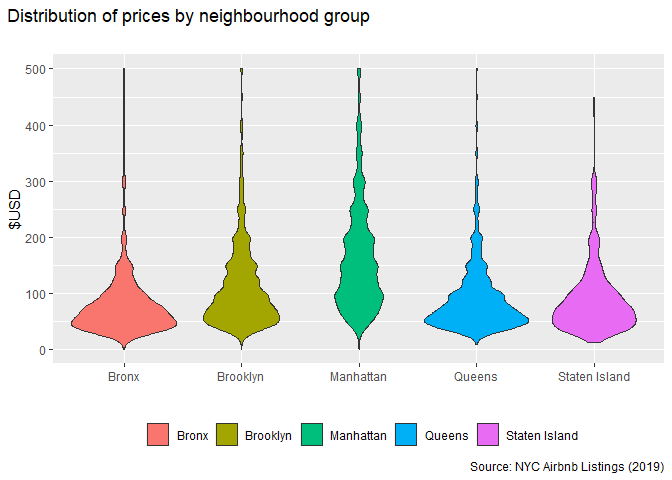

# Data Exploration

## Introduction

Since 2008, guests and hosts have used Airbnb to expand on traveling
possibilities and present more unique, personalized way of experiencing
the world. This dataset describes the listing activity and metrics in
NYC, NY for 2019. The original source for this data can be found on this
<http://insideairbnb.com/>. In this article, we will explore this data
to gain valuable insights into listings.

Let us start by loading up the necessary packages.

``` r
library(tidyverse)
```

## Read Data

We can read the data from the CSV file into a dataframe.

``` r
listings <- readr::read_csv('data/AB_NYC_2019.csv')
```

    ## Rows: 48895 Columns: 16
    ## -- Column specification -------------------------------------------------------------------------------------------
    ## Delimiter: ","
    ## chr   (5): name, host_name, neighbourhood_group, neighbourhood, room_type
    ## dbl  (10): id, host_id, latitude, longitude, price, minimum_nights, number_of_reviews, reviews_per_month, calcu...
    ## date  (1): last_review
    ## 
    ## i Use `spec()` to retrieve the full column specification for this data.
    ## i Specify the column types or set `show_col_types = FALSE` to quiet this message.

``` r
listings
```

    ## # A tibble: 48,895 x 16
    ##       id name    host_id host_name neighbourhood_g~ neighbourhood latitude longitude room_type price minimum_nights
    ##    <dbl> <chr>     <dbl> <chr>     <chr>            <chr>            <dbl>     <dbl> <chr>     <dbl>          <dbl>
    ##  1  2539 Clean ~    2787 John      Brooklyn         Kensington        40.6     -74.0 Private ~   149              1
    ##  2  2595 Skylit~    2845 Jennifer  Manhattan        Midtown           40.8     -74.0 Entire h~   225              1
    ##  3  3647 THE VI~    4632 Elisabeth Manhattan        Harlem            40.8     -73.9 Private ~   150              3
    ##  4  3831 Cozy E~    4869 LisaRoxa~ Brooklyn         Clinton Hill      40.7     -74.0 Entire h~    89              1
    ##  5  5022 Entire~    7192 Laura     Manhattan        East Harlem       40.8     -73.9 Entire h~    80             10
    ##  6  5099 Large ~    7322 Chris     Manhattan        Murray Hill       40.7     -74.0 Entire h~   200              3
    ##  7  5121 BlissA~    7356 Garon     Brooklyn         Bedford-Stuy~     40.7     -74.0 Private ~    60             45
    ##  8  5178 Large ~    8967 Shunichi  Manhattan        Hell's Kitch~     40.8     -74.0 Private ~    79              2
    ##  9  5203 Cozy C~    7490 MaryEllen Manhattan        Upper West S~     40.8     -74.0 Private ~    79              2
    ## 10  5238 Cute &~    7549 Ben       Manhattan        Chinatown         40.7     -74.0 Entire h~   150              1
    ## # ... with 48,885 more rows, and 5 more variables: number_of_reviews <dbl>, last_review <date>,
    ## #   reviews_per_month <dbl>, calculated_host_listings_count <dbl>, availability_365 <dbl>

## Explore Data

There are many different questions to explore with this data. Let us
start by looking at the top neighborhoods with listings.

``` r
by_neighbourhood <- listings %>%
  count(neighbourhood, name = 'nb_listings', sort = TRUE)

by_neighbourhood
```

    ## # A tibble: 221 x 2
    ##    neighbourhood      nb_listings
    ##    <chr>                    <int>
    ##  1 Williamsburg              3920
    ##  2 Bedford-Stuyvesant        3714
    ##  3 Harlem                    2658
    ##  4 Bushwick                  2465
    ##  5 Upper West Side           1971
    ##  6 Hell's Kitchen            1958
    ##  7 East Village              1853
    ##  8 Upper East Side           1798
    ##  9 Crown Heights             1564
    ## 10 Midtown                   1545
    ## # ... with 211 more rows

Let us visualize the data using a horizontal bar plot.

``` r
plot_by_neighbourhood <- by_neighbourhood %>%
  head(10) %>%
  mutate(neighbourhood = forcats::fct_reorder(neighbourhood, nb_listings)) %>%
  ggplot(aes(x = nb_listings, y = neighbourhood)) +
  geom_col() +
  labs(
    title = 'Top 10 NYC Neighbourhoods with Airbnb listings',
    subtitle = '',
    x = '',
    y = ''
  ) +
  theme(
    plot.title.position = 'plot'
  )

plot_by_neighbourhood
```



How about the distribution of prices across neighbourhoods? Rather than
looking at neighbourhoods, we will focus our attention on neighbourhood
groups.

``` r
plot_listings_price_violin <- listings %>%
  filter(price <= 500) %>%
  ggplot(aes(x = neighbourhood_group, y = price)) +
  geom_violin(aes(fill = neighbourhood_group)) +
  labs(
    title = 'Distribution of prices by neighbourhood group',
    subtitle = '',
    caption = 'Source: NYC Airbnb Listings (2019)',
    x = '',
    y = '$USD',
    fill = ''
  ) +
  theme(
    plot.title.position = 'plot',
    legend.position = 'bottom'
  )

plot_listings_price_violin
```


